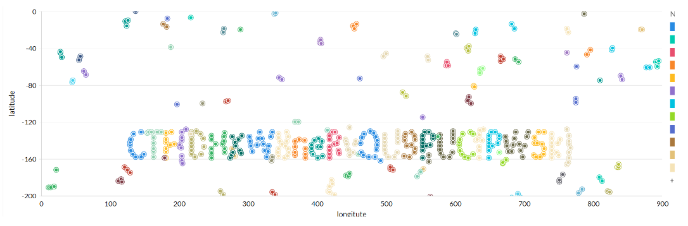

# Checking The Location Database

---

Medium | PPC | 50 Points 

---

### Description

Can you connect to the vehicle database of our city?

---

### First Impressions

We are given the following link: tcp://portal.hackazon.org:17008

So time for some investigation on that address. 

### NMAP output

```php
└─$ nmap portal.hackazon.org -p17008 -sV -sC
Starting Nmap 7.92 ( https://nmap.org ) at 2022-07-12 02:44 EDT
Nmap scan report for portal.hackazon.org (136.243.68.77)
Host is up (0.30s latency).
rDNS record for 136.243.68.77: static.77.68.243.136.clients.your-server.de

PORT      STATE SERVICE VERSION
17008/tcp open  redis   Redis key-value store

Service detection performed. Please report any incorrect results at https://nmap.org/submit/ .
Nmap done: 1 IP address (1 host up) scanned in 13.91 seconds
```

We find a redis store. I have no idea what a redis store is so to HackTricks! [Information here](https://book.hacktricks.xyz/network-services-pentesting/6379-pentesting-redis).

So lets get some info from this redis store. 

```php
└─$ nc -vn 136.243.68.77 17008      
(UNKNOWN) [136.243.68.77] 17008 (?) open
info

```

We see the following in the info

```bash
# Keyspace
db0:keys=1002,expires=0,avg_ttl=0
```

According to hacktricks, this means we have one database inside. We can connect with SELECT 0 and view all keys with KEYS *. I won’t copy all the keys here since there are 1002 of them but a search through the results unveils a _flag key! Very suspicious. And sure enough, if we GET that key, we get our flag for the first part of this challenge!

```php
GET _flag
$25
CTF{DGErbbodqEeHQhjeDs8g}
```

# WHAT IS GOING IN WITH THE AI?

---

Medium | PPC | 200 points 

---

## Description

Can you find out what the AI is doing? The city is almost paralized with fear, every second counts!

---

So we have the hint that “every second counts!” which from examining the redis store over time, seems to mean that the data in this redis store is changing every second. We can also see that the data in the redis store consists of a number plate and a longitude and latitude coordinate as the following data sample shows.

```bash

2) "aa6c480e-1a14-4cc0-80c1-2e9622e1aabc"                                                            
 3) 1) "$"                                                                                             
    2) "{\"number_plate\":\"PI-65-GB\",\"longitude\":-122,\"latitude\":-75}"                           

```

So, presumably, we need to graph out how the data changes over time. So the easiest way to do that is to create a script to export all the data into a .csv for easy graphing. I did this scripting in two parts. First I made a C++ script to get all the coordinates at one point in time and then I made a bash script to run that C++ program every second for 60 seconds and place the output it gets into a csv file.
You can find the C++ script named as “RetreiveData.cpp” and the bash script as “GetDataOverTime.sh” in this github repo. 

If we graph our resulting csv, we get a massive graph and if we zoom in a bit, we see the following message! Our flag is CTF{DHXW8neRvQU9PUCfPW5k}


